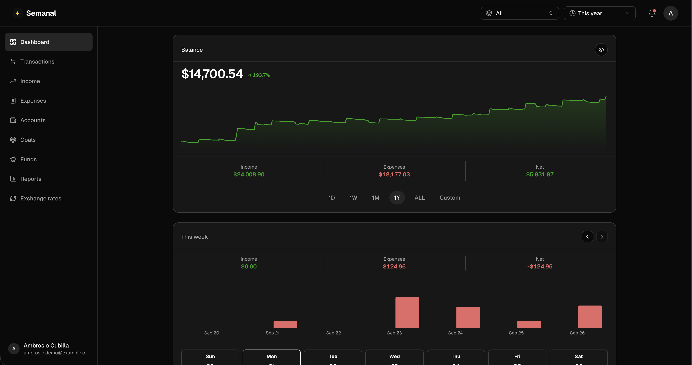
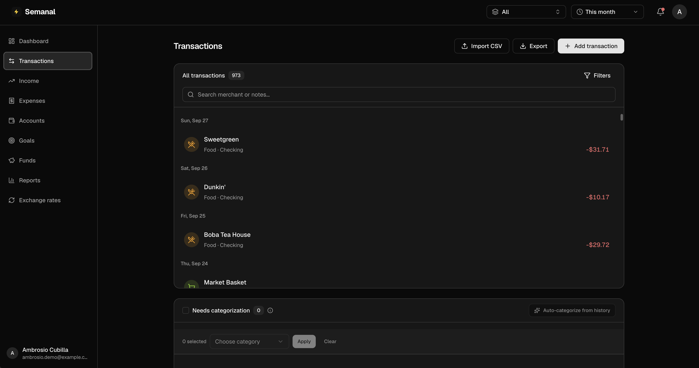
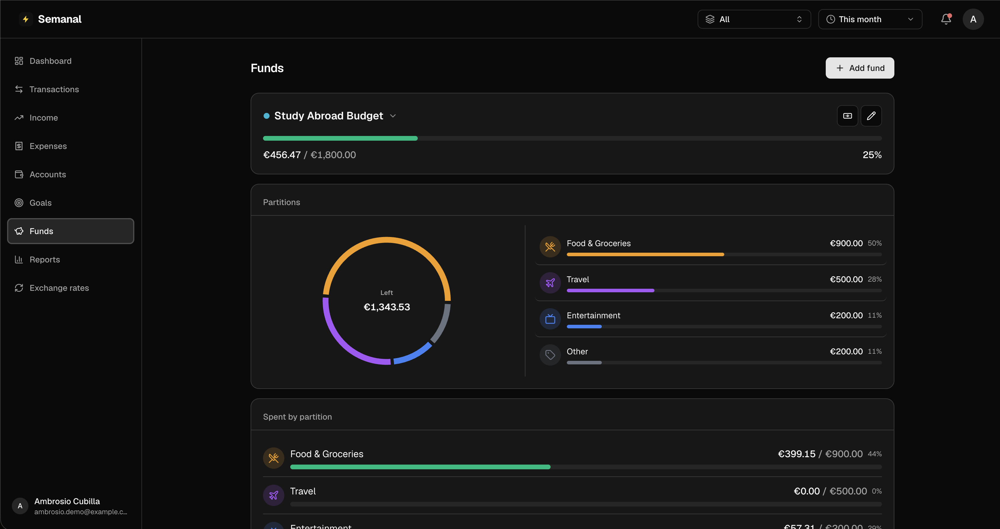
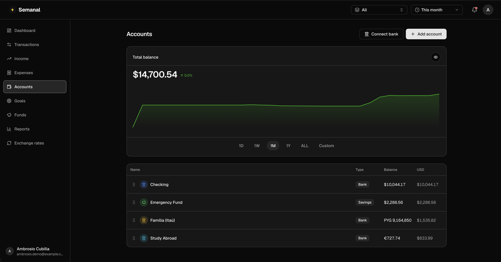
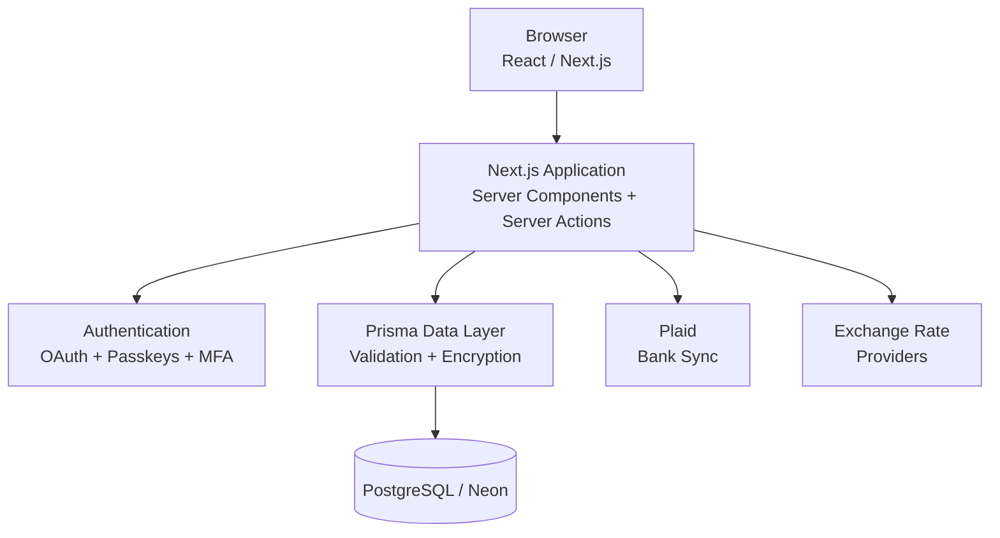

# Semanal

**A multi-currency personal finance tracker focused on financial observability and control over the short and medium term.**

[**Try Semanal Live →**](https://semanal.dev)

No account is required. Select **Guest Login** on the sign-in page to explore Semanal with demo financial data.

The production source code is private. This repository is a public overview of the project, what it does, and some of the engineering behind it.

## Why I Built It

I had spent a lot of time adding observability to my own server and homelab. Then, while working at Tufts Technology Services over the summer, I had to manage my finances closely for the first time and realized I was missing that same visibility in one place: **my money**.

After trying a lot of personal finance apps, none really matched what I needed. I wanted:

* A **weekly** view of my spending, not only monthly summaries
* Accounts and transactions across **multiple currencies**
* Bank accounts, cash, and manual accounts in one place
* Transfers that do not get counted as income or spending
* Better visibility into my finances over the **short and medium term**
* Goals and budgeting that matched how I actually manage money

So I built **Semanal**.

It has the usual features you would expect from a personal finance app, but it has also grown alongside my needs as a college student learning how to manage a real budget.

Being an international student shaped some of those needs too:

* Money across multiple currencies
* Accounts in different places
* Cross-currency transfers
* Shorter-term budgeting and planning
* One place to understand my complete financial picture

Those problems are not unique to me. Other students, especially international students, can run into many of the same challenges.

As my needs changed throughout the summer and semester, **Semanal changed with them**.

## Screenshots

<table>
  <tr>
    <td>
      <strong>Dashboard</strong><br>
      
    </td>
    <td>
      <strong>Transactions</strong><br>
      
    </td>
  </tr>
  <tr>
    <td>
      <strong>Funds</strong><br>
      
    </td>
    <td>
      <strong>Accounts</strong><br>
      
    </td>
  </tr>
</table>

## Financial Observability

The main idea behind Semanal is simple:

**I want to know what is happening with my money without having to manually piece it together.**

Semanal helps me answer questions like:

* Where is my money going?
* How much have I spent this week?
* How does that compare with previous weeks?
* How much money do I actually have across all my accounts?
* Which categories am I spending the most on?
* Am I staying within my goals?
* What does my financial picture look like across different currencies?

A lot of finance tools focus heavily on long-term planning. Semanal is more focused on **visibility and control over the short and medium term**.

The weekly view is also where the name comes from: **semanal means "weekly" in Spanish.**

## Features

### Transactions

* Manual income and expenses
* Transfers between accounts
* Automatic bank synchronization
* CSV imports
* Editing and deleting transactions
* Search, filtering, and sorting
* Automatic categorization
* Custom categorization rules
* Balance reconciliation
* Cross-currency transfers

Transfers are treated separately from income and expenses. Moving $500 from checking to savings should not make it look like I spent $500 and then earned another $500.

### Accounts

Semanal supports:

* Bank
* Savings
* Credit
* Cash
* Investment
* Crypto

Each account can:

* Use its own currency
* Be included or excluded from net worth
* Have its own icon and color
* Be manually managed or connected to a financial institution

### Multi-Currency

Multi-currency support is built into the underlying financial model instead of being added only when displaying a number.

Semanal currently supports **12 currencies** with:

* Per-account currencies
* Transactions in their original currency
* Historical exchange rates
* Cross-currency transfers
* Configurable home currency
* Exchange-rate caching
* Currency conversion
* Rate history and trends

Each transaction keeps its original amount and currency while also being normalized so totals like spending and net worth can be calculated across currencies.

### Dashboard & Analytics

The dashboard provides visibility into:

* Net worth
* Income
* Spending
* Net cash flow
* Spending by category
* Income by category
* Recent transactions
* Account balances
* Balance history
* Largest transactions
* Goal progress

Views can be changed between:

* Day
* Week
* Month
* Year
* All time
* Custom ranges

Custom ranges can also be saved for later.

### Goals

Semanal supports three main types of goals:

* **Spend Under**: stay below a spending limit
* **Save At Least**: reach a savings target
* **Fund an Account**: track new money added to an account

Goals can be:

* Weekly
* Monthly
* Custom date ranges
* Scoped to selected accounts
* Scoped to categories
* Scoped to Spaces

Completed periods are saved so I can look back and see whether I met or missed previous goals.

### Spaces

Spaces let me look at different parts of my finances without separating the underlying data.

For example:

```text
All Finances
├── United States
├── Paraguay
└── Investing
```

A Space is another view over the same accounts.

An account can belong to multiple Spaces while everything still uses one source of truth.

### Bank Synchronization

Semanal uses **Plaid** to automatically import transactions.

The synchronization system includes:

* Cursor-based incremental sync
* OAuth redirect handling
* Independent failure handling between connections
* Automatic balance reconciliation
* Catch-up sync for stale connections
* Transfer detection
* Transaction deduplication
* Invalid connection handling

One thing I cared about here was failure isolation: **one broken bank connection should not stop every other account from updating.**

### Transaction Categorization

Automatic categorization follows this order:

1. How I categorized that merchant before
2. User-created rules
3. Plaid's categorization
4. Built-in fallback rules

Semanal also normalizes merchant names before categorization.

Bank descriptions can contain card authorization prefixes, ACH information, confirmation numbers, store numbers, and other bank-specific noise. Normalization helps Semanal recognize when different descriptions actually refer to the same merchant.

Over time, the system can adapt to the way I personally categorize my transactions.

## Security

Security was not the original purpose of Semanal.

That changed once I started connecting real financial accounts and storing data that I actually depended on. At that point, just having a login was not enough.

I started applying a lot of what I was learning through IAM and security work to the app itself.

### Authentication

Semanal supports:

* Google OAuth
* Passwordless WebAuthn / passkeys
* TOTP MFA
* Passkeys as an MFA factor
* Database-backed sessions
* Invite-only access
* Re-authentication before privileged administrative actions

Authentication and MFA are enforced centrally instead of relying on every individual page to remember to check them.

### Encryption at Rest

Sensitive financial and authentication data uses **per-user envelope encryption**.

```text
Master encryption key
        │
        ▼
Wrapped per-user key
        │
        ▼
   Derived keys
        │
        ▼
 Encrypted data
```

The design uses:

* AES-256-GCM
* A separate data-encryption key for each user
* HKDF-derived subkeys
* Random nonces
* Authenticated context
* Blind indexes for exact-match searches over encrypted data

Encryption is integrated into the Prisma data layer, so the rest of the application does not have to manually encrypt and decrypt values.

The rollout was also done incrementally:

1. Write encrypted copies
2. Backfill existing data
3. Verify the encrypted data
4. Switch reads to encrypted values
5. Remove the remaining plaintext values

## Audit Logging & Observability

Observability is where the idea for Semanal started, so eventually I wanted the application itself to have better observability too.

Semanal records security-relevant events such as:

* Login and logout
* Failed authentication
* MFA enrollment and verification
* Passkey registration
* Administrative access
* Bank connections and synchronization
* Security-sensitive changes
* Encryption and decryption failures

Sensitive identifiers such as emails and IP addresses are not stored directly in plaintext in the audit log.

Logging is also kept outside the critical path where possible. A failed audit write should not make an unrelated user action fail.

The admin side gives me visibility into:

* Daily, weekly, and monthly active users
* Failed logins
* Application errors
* Per-user audit history
* Passkey and MFA adoption
* Users without additional authentication protection
* Security events that may need investigation

Semanal ended up with two kinds of observability:

* **Financial observability** — what is happening with my money
* **Application observability** — what is happening inside the system managing it

## Architecture

Semanal is built with **Next.js, TypeScript, PostgreSQL, and Prisma** and deployed on **Vercel**.



Most application logic uses Next.js Server Actions instead of a separate REST or GraphQL backend.

API routes are used where actual HTTP endpoints make sense, including:

* Authentication callbacks
* WebAuthn ceremonies
* Plaid integration
* Webhooks
* Scheduled tasks

## Some Engineering Decisions

### Incremental Balances

Instead of recalculating an account's entire transaction history every time its balance is needed:

* Transactions update balances incrementally
* Connected accounts are reconciled with institution-reported balances
* Historical balance charts are reconstructed from the ledger

This avoids maintaining another full balance-history dataset that also needs to stay synchronized.

### Concurrency-Safe Balance Updates

Encrypting account balances created an interesting problem.

Before encryption, Postgres could atomically increment a numeric balance. Once the balance itself became encrypted, it could no longer simply add a number to it.

Semanal now:

1. Locks the account row
2. Decrypts the balance
3. Calculates the new balance
4. Encrypts it again
5. Writes it back inside the same transaction

Operations touching multiple accounts acquire locks in a consistent order to avoid deadlocks.

### Lazy Work Instead of Cron Jobs Everywhere

I try not to schedule work just because something eventually needs to happen.

Examples:

* Goal periods are finalized when the Goals page is next opened
* Stale Plaid connections can catch up after user activity
* Exchange-rate preloading stays scheduled because it actually depends on time

### Currency Normalization

Every transaction keeps:

* Its original amount
* Its original currency
* A normalized representation for aggregation

Semanal can then sum values consistently and convert the final result into the selected display currency instead of repeatedly converting every transaction.

### Keeping Business Logic Testable

Where possible, financial logic is kept separate from Next.js and the database.

That includes:

* Goal calculations
* Fund calculations
* Currency conversion
* Categorization
* CSV processing
* Cryptographic primitives

These can be tested as normal functions without starting the entire application.

## Tech Stack

| Area             | Technology             |
| ---------------- | ---------------------- |
| Framework        | Next.js 16             |
| Language         | TypeScript             |
| Frontend         | React 19               |
| UI               | Tailwind CSS, Radix UI |
| Database         | PostgreSQL / Neon      |
| ORM              | Prisma                 |
| Authentication   | NextAuth, WebAuthn     |
| MFA              | TOTP, Passkeys         |
| Bank Integration | Plaid                  |
| Validation       | Zod                    |
| Charts           | Recharts               |
| Testing          | Vitest, Playwright     |
| Deployment       | Vercel                 |

## Testing

Semanal has automated unit, integration, and end-to-end testing.

Tests cover:

* Financial calculations
* Currency conversion
* Goals and budgeting
* Transaction categorization
* CSV processing
* Cryptographic primitives
* Authentication
* Important application flows

I use:

* **Vitest** for unit and integration tests
* **Playwright** for browser-level testing
* TypeScript checking
* Linting
* Production builds

## Try It

Semanal is live at **[semanal.dev](https://semanal.dev)**.

* No account is required
* Choose **Guest Login**
* Explore the app using sample financial data
* No real user financial information is exposed

## Why Is the Source Private?

Semanal is a personal project, but it is also the finance app I actually use.

It connects to real financial accounts and handles sensitive data, so I keep the production source repository private.

## About

I designed and built Semanal independently.

It started from a problem I had myself and has grown alongside my needs as a college student managing my own budget.

Some of those needs are especially relevant to me as an international student, but they can apply to other students too.
